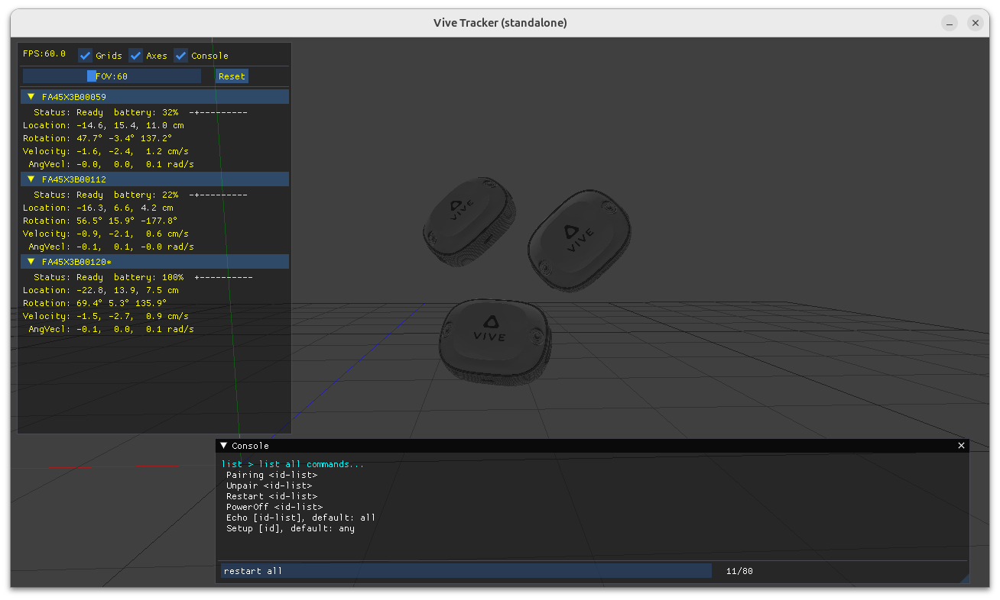
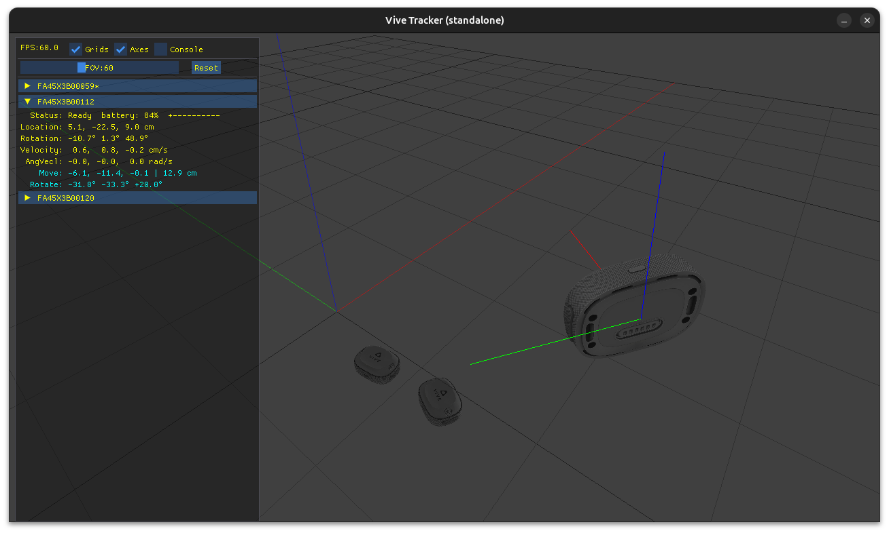
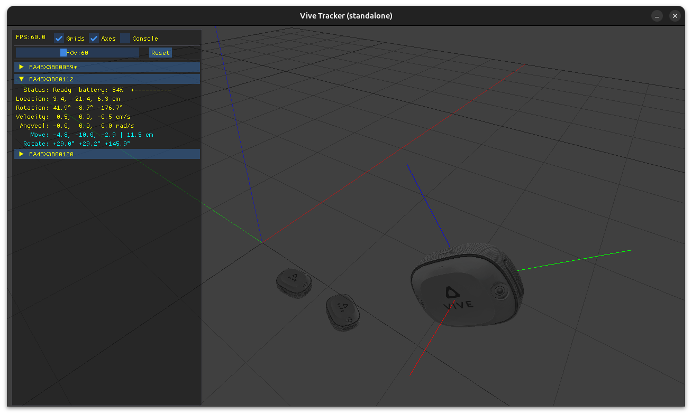
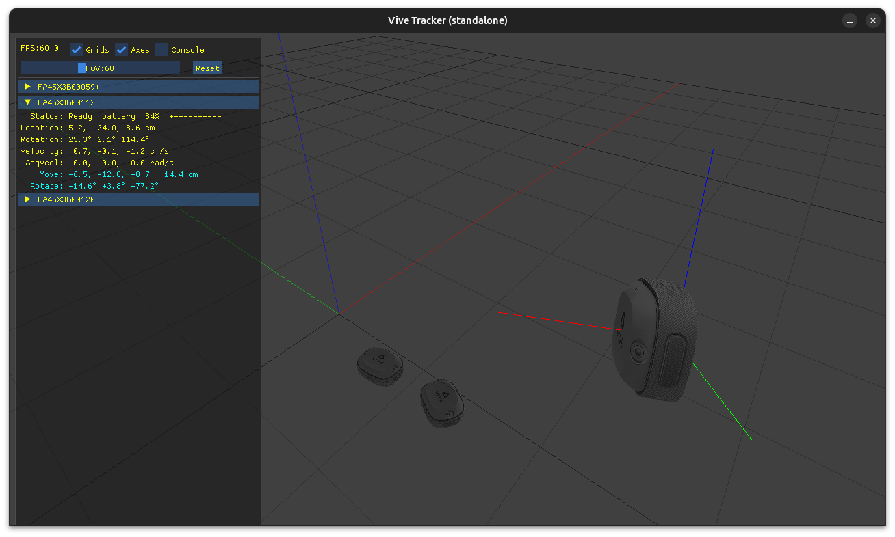

# VIVE Ultimate Tracker Linux SDK (Beta)
C++ library for HTC VIVE Ultimate Tracker integration in robotics applications.
The beta version has been tested on Ubuntu. Other distros should work, but are currently untested.


## How to Use
The library provides two classes for different use cases: 
1. **`ITrackerSubscriber`** - Direct server mode (for standalone applications)
2. **`ITrackerIPCClient`** - IPC client mode (for multi-process applications)

Please check out the [VIVE-Tracker-SDK-Guide-EN.md](./VIVE-Ultimate-Tracker-SDK-Guide-EN.md) for the full set up guide, including how to create your map and optimising your physical environment for tracking.


## Mode 1: ITrackerSubscriber (Direct Server)
Callbacks are invoked directly from the tracker server thread. This is the lowest-latency mode for receiving tracker updates. A server mode app needs to call StartTrackerServer() and StopTrackerServer(). Having multiple subscribers is possible.
```cpp
class MyTracker : public vive::ITrackerSubscriber {
  void ServerStart() override {
    // tracker server is about to start 
  }
  void ServerStop() override {
    // tracker server is about to stop
  }
  void Add(uint32_t tracker_id, char const* name) override {
    // a tracker is detected and initialized
  }
  void Update(TrackerData const& data) override {
    // a tracker pose is updated.
  }
  void Click(uint32_t tracker_id, int button_id, int clicks) override {
    // a tracker's button is clicked. For a single-button Ultimate Tracker, button_id is always 0.
    // Take double-click for example, Click() will be called 4 times:
    // 1) clicks = 1 --> when the 1st click occurs
    // 2) clicks = 0 --> when the 1st click is released
    // 3) clicks = 2 --> when the 2nd click occurs
    // 4) clicks = 0 --> when the 2nd click is released
  }
  void Remove(uint32_t tracker_id) override {
    // a tracker is about to disconnect.
  }

  //
  // Tracker commands and command response:
  // Commands are sent via ITrackerSubscriber::SendCommand(), accepted commands:
  //  1) "Pairing <id-list>", e.g. "Pairing 0,1,2" to pair tracker slot 0, 1, 2.
  //     The user will need to press the tracker button to pair. (id-list is mandatory)
  //  2) "Unpair <id-list>" to unpair trackers.
  //  3) "Restart <id-list>" to disconnect and restart trackers.
  //  4) "PowerOff <id-list>" to power off the trackers.
  //  5) "Echo [id-list]" to identify a tracker; triggers tracker light flashing.
  //  6) "Setup [id]" to set up a tracker, i.e. to build a map from the environment.
  //
  // Sending other commands will still trigger CommandResponse() to get current tracker states.
  void CommandResponse(TrackerCommandResponse const& response) override {
    // Command response from tracker server. Note: the CURRENT tracker states will be returned.
  }

public:
  MyTracker() = default;
};

int main() {
  MyTracker tracker;
  if (vive::StartTrackerServer()) { // start server
    while (running) {
      // do work, callbacks happen automatically
    }
    vive::StopTrackerServer(); // stop server
  }
  return 0;
}
```


## Mode 2: ITrackerIPCClient (Client mode)
Connects to tracker server via **Unix Domain Socket**. Requires calling ***Poll()*** repeatedly to receive updates. Callbacks are invoked from the ***Poll()*** function (same thread). You can run as many clients as you like. Remember you still need a tracker server to run with your client app; the server may be as simple as **/demo/tracker_demo.cpp**. Also refer to **tracker_ipc_client_ref.py** for Python implementation.
```cpp
class MyTrackerClient : public vive::ITrackerIPCClient {
  //
  // override all methods like Direct server mode
  ...

public:
  MyTrackerClient() = default;
};

int main() {
  MyTrackerClient client;
  while (running) {
    client.Poll(); // call every frame

    // do other work or take a nap...
    std::this_thread::sleep_for(std::chrono::milliseconds(16));
  }
  client.Disconnect();
  return 0;
}

```


## Build and Run

```bash
cd vive-ultimate-tracker-sdk
mkdir build && cd build
cmake .. && cmake --build . && make install

# to run (server=tracker_demo + client=tracker_viewer)
cd bin
./tracker_demo --viewer

# to run standalone viewer (acts like a server)
./tracker_viewer_standalone
```


## Components

- **./include/** and **./bin/** - header file + shared library

- **./demo/tracker_demo.cpp, tracker_demo2.cpp** - demonstrates **ITrackerSubscriber** and **ITrackerIPCClient** usage.
    ```
    cmdline: ./tracker_demo [--viewer]
      --viewer run with embedded tracker_viewer.
      triple-clicks to terminate.
    ```

- **./viewer/tracker_viewer.cpp** - implemented using **ITrackerIPCClient**. 
    ```
    cmdline: ./tracker_viewer [--fullscreen]
      single-click to align viewpoint, toggle odo mode.
      can run multiple tracker_viewer for viewing different viewpoints.
      use embedded console (press F2) to send commands.
    ```

- **./viewer/tracker_viewer_standalone.cpp** - implemented using **ITrackerSubscriber**.
    ```
    cmdline: ./tracker_viewer_standalone [--fullscreen]
      single-click to align viewpoint, toggle odo mode.
      can run multiple tracker_viewer for viewing different viewpoints.
      use embedded console (press F2) to send commands.
    ```

<figure>
  
  <figcaption>Use console to send commands (pairing/unpair/restart/poweroff/echo/setup)</figcaption>
</figure>

# Coordinate System
- Like **[Isaac Sim](https://docs.isaacsim.omniverse.nvidia.com/latest/reference_material/reference_conventions.html#world-axes)**, VIVE ultimate tracker SDK follows right-handed coordinate conventions.
    <table>
      <tr>
        <td style="text-align:right; padding-right:8px"><strong>Forward:</strong></td>
        <td style="color: FF0000;text-align:left">+X</td>
      </tr>
      <tr>
        <td style="text-align:right; padding-right:8px"><strong>Up:</strong></td>
        <td style="color: 0000FF;text-align:left">+Z</td>
      </tr>
    </table>

  
  
  

## Requirements
- Linux (Ubuntu 22.04+)
- GCC 7+ with C++17 support
- VIVE Ultimate Trackers + USB Dongle
- tracker_viewer Dependencies: opencv, opengl, glew, glfw and imgui (included)
  ```bash
  apt install build-essential
  apt install libopencv-dev libglew-dev libglfw3-dev
  ```
- Go through the full setup guide [VIVE-Tracker-SDK-Guide-EN.md](./VIVE-Ultimate-Tracker-SDK-Guide-EN.md)


## Known Issues
- In rare cases, map syncing may take a little time. Keep all trackers close together until completed or try **restart all** command.


## Licensing
Your use of **vive-ultimate-tracker-sdk** is governed by the **VIVE Product EULA**, linked from [LICENSE](./LICENSE.txt)

- `LICENSE.txt` — HTC's copyright and license notice for **vive-ultimate-tracker-sdk**.
- `ThirdPartyLicenses.txt` — the third-party components the Linux packages
  include and their respective license terms. You must comply with those terms
  while using the identified third-party software.

