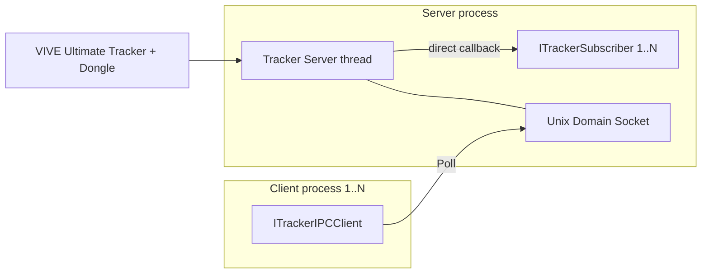
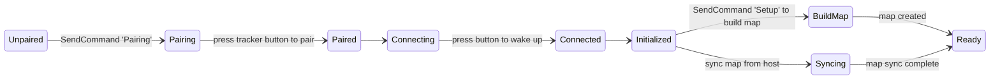
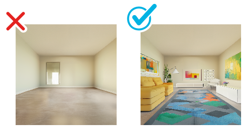
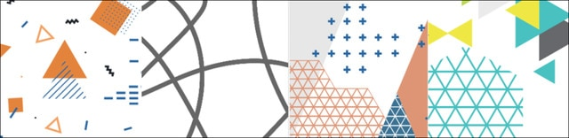
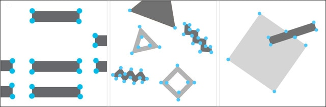
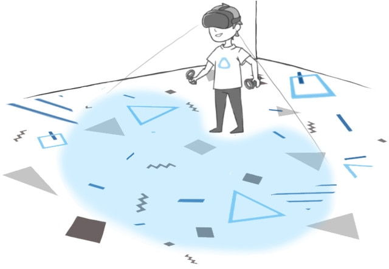
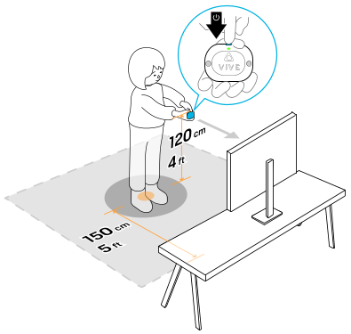
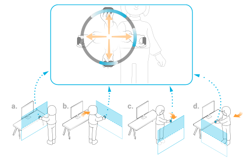
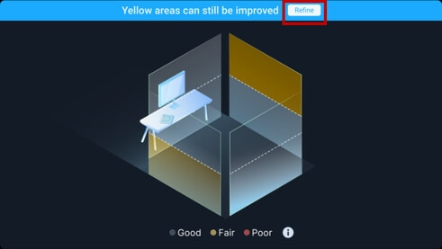

# VIVE Ultimate Tracker SDK Developer Guide

**Version:** v0.0.1 (2026/09/09 BETA release) | **Platform:** Linux (x64 / arm64) | **Language:** C++17

This guide explains how to integrate the HTC VIVE Ultimate Tracker into robotics and other applications using the VIVE Tracker SDK. It covers the two usage modes, a complete API reference, the command system, and environment setup guidelines for maximizing tracking accuracy.

---

## Table of Contents

1. [Overview and Architecture](#1-overview-and-architecture)
2. [System Requirements](#2-system-requirements)
3. [Getting and Building the SDK](#3-getting-and-building-the-sdk)
4. [Quick Start](#4-quick-start)
5. [Tracker Lifecycle and States](#5-tracker-lifecycle-and-states)
6. [API Reference](#6-api-reference)
7. [Command System (SendCommand)](#7-command-system-sendcommand)
8. [Threading Model and Usage Notes](#8-threading-model-and-usage-notes)
9. [Improving Tracking Accuracy: Environment Setup Guide](#9-improving-tracking-accuracy-environment-setup-guide)
10. [Troubleshooting and Known Issues](#10-troubleshooting-and-known-issues)
11. [Appendix A: Documentation Gaps and Open Questions](#appendix-a-documentation-gaps-and-open-questions)

---

## 1. Overview and Architecture

The SDK uses a **server/client** architecture. One process calls `vive::StartTrackerServer()` to become the **Tracker Server**, which talks directly to the VIVE Ultimate Trackers (via the dongle). Other processes can connect to the server over a **Unix Domain Socket** as IPC clients to receive the same data.



| | **Mode 1: `ITrackerSubscriber`** | **Mode 2: `ITrackerIPCClient`** |
|---|---|---|
| Use case | Standalone single-process application | Multi-process application (server runs separately) |
| Data delivery | Server thread invokes callbacks **automatically** | You must call `Poll()` **every frame** |
| Callback thread | Tracker server thread | The thread that calls `Poll()` |
| Latency / priority | Highest (most immediate) | Lower (depends on poll rate) |
| Instance limit | Multiple subscribers allowed | Unlimited clients |
| Prerequisite | Call `StartTrackerServer()` | A server is already running on the same machine |

Both modes share an identical callback interface (`Add` / `Update` / `Click` / `Remove` / `ServerStart` / `ServerStop` / `CommandResponse`), so the same handler logic can be applied to both modes with a template (see the `TrackerService<BaseClass, id_offset>` pattern in `demo/tracker_demo2.cpp`).

---

## 2. System Requirements

- Linux (Ubuntu 22.04 or later), x64 or arm64
- GCC 7 or later with C++17 support
- VIVE Ultimate Tracker + USB Dongle
- Additional dependencies for the viewer samples: OpenCV, OpenGL, GLEW, GLFW, imgui (bundled)

```bash
apt install build-essential
apt install libopencv-dev libglew-dev libglfw3-dev
```

---

## 3. Getting and Building the SDK

SDK directory layout:

```
vive-ultimate-tracker-sdk/
├── include/ultimate_tracker.h  # the only header you need to include
├── bin/linux/{x64,arm64}/libultimate-tracker.so  # prebuilt shared library
├── demo/                       # ITrackerSubscriber / ITrackerIPCClient samples
├── viewer/                     # 3D visualization viewer (IPC client and standalone)
└── tracker_ipc_client_ref.py   # IPC client Python reference implementation
```

### Building the samples

```bash
cd vive-ultimate-tracker-sdk
mkdir build && cd build
cmake .. && cmake --build . && make install

# to run (server=tracker_demo + client=tracker_viewer)
cd bin
./tracker_demo --viewer

# to run standalone viewer (acts like a server)
./tracker_viewer_standalone
```

### Integrating into your own project

The SDK ships as a **shared library**. Include a single header and link the `.so` for your platform:

```cmake
set(VIVETRACKER_SDK ${CMAKE_SOURCE_DIR}/third_party/vive-ultimate-tracker-sdk)

add_executable(my_robot_app main.cpp)
target_include_directories(my_robot_app PRIVATE ${VIVETRACKER_SDK}/include)
target_link_libraries(my_robot_app PRIVATE
	${VIVETRACKER_SDK}/bin/linux/x64/libultimate-tracker.so   # use bin/linux/arm64 for arm64
	pthread)
set_target_properties(my_robot_app PROPERTIES
	INSTALL_RPATH "$ORIGIN"  # or set other runtime search path (rpath)
	BUILD_WITH_INSTALL_RPATH TRUE
)
install(FILES ${VIVETRACKER_SDK}/bin/linux/x64/libultimate-tracker.so DESTINATION ${INSTALL_DIR})
```

---

## 4. Quick Start

### Mode 1: ITrackerSubscriber (direct server mode)

Derive from `vive::ITrackerSubscriber` and implement all pure virtual methods. **The subscriber object must be created before calling `StartTrackerServer()`.** Once the server starts, callbacks are invoked automatically from the server thread.

```cpp
#include "ultimate_tracker.h"
#include <thread>
#include <cstdio>

class MyTracker : public vive::ITrackerSubscriber {
  bool stop_{false};

  void ServerStart() override {}               // server is about to start
  void ServerStop() override { stop_ = true; } // server is about to stop

  void Add(uint32_t tracker_id, char const* name) override {
    printf("tracker %u (%s) added\n", tracker_id, name ? name : "");
  }

  void Update(vive::TrackerData const& d) override {
    // Called on every pose update. Do not block here (see section 8).
    // d.Location[3] in meters, d.Rotation[4] quaternion (qx,qy,qz,qw)
    // latency = vive::GetTimestamp() - d.Timestamp_us (microseconds)
  }

  void Click(uint32_t tracker_id, int button_id, int clicks) override {
    // The Ultimate Tracker has a single button, so button_id is always 0
    if (clicks >= 3) stop_ = true;  // e.g. triple-click to quit
  }

  void Remove(uint32_t tracker_id) override {} // tracker timed out / disconnecting

  void CommandResponse(vive::TrackerCommandResponse const& r) override {
    printf("cmd '%s' -> %s\n", r.Command, r.Result);
  }

public:
  bool Stop() const { return stop_; }
};

int main(int argc, char** argv) {
  MyTracker tracker;                              // create the subscriber first
  if (!vive::StartTrackerServer(argc, argv)) {    // then start the server
    fprintf(stderr, "failed to start tracker server\n");
    return 1;
  }
  while (!tracker.Stop()) {
    // the main thread is free to do its own work; callbacks happen automatically
    std::this_thread::sleep_for(std::chrono::milliseconds(10));
  }
  vive::StopTrackerServer();
  return 0;
}
```

### Mode 2: ITrackerIPCClient (IPC client mode)

Prerequisite: a tracker server is already running on the same machine (for example `tracker_demo`, or your own server program). The client must call **`Poll()` every frame**; callbacks are triggered inside `Poll()` on the same thread.

```cpp
#include "ultimate_tracker.h"
#include <thread>

class MyClient : public vive::ITrackerIPCClient {
  bool server_stop_{false};

  void ServerStart() override {}
  void ServerStop() override { server_stop_ = true; }  // server shut down
  void Add(uint32_t id, char const* name) override {}
  void Update(vive::TrackerData const& d) override {}
  void Click(uint32_t id, int button, int clicks) override {}
  void Remove(uint32_t id) override {}
  void CommandResponse(vive::TrackerCommandResponse const&) override {}

public:
  bool ServerStopped() const { return server_stop_; }
};

int main() {
  MyClient client;
  while (!client.ServerStopped()) {
    client.Poll();  // returns false while not connected to a server
    std::this_thread::sleep_for(std::chrono::milliseconds(16));
  }
  client.Disconnect();
  return 0;
}
```

> **Tip:** A single server process can use both modes at once (see `tracker_demo2.cpp`, which runs 2 subscribers and 3 IPC clients side by side).

---

## 5. Tracker Lifecycle and States

`TrackerState` describes the full tracker lifecycle. **Subscribers and IPC clients only see trackers in the `Syncing`, `BuildMap`, and `Ready` states**; the remaining states are only visible through the full state table reported by `CommandResponse`.



| Value | State | Description |
|---|---|---|
| 0 | `Unpaired` / `NA` | Not paired (invisible to clients) |
| 1 | `Pairing` | Pairing in progress (press the tracker button) |
| 2 | `Paired` | Paired |
| 3 | `Connecting` | Connecting; the tracker may be off — press the button to wake it |
| 4 | `Connected` | Tracker data received |
| 5 | `Initialized` | Initialized but not yet tracking |
| 6 | `Syncing` | Syncing the map from the host, or the host has no map yet (Setup required) |
| 7 | `BuildMap` | Host is building a map (Setup flow) |
| 8 | `Ready` | Map ready, tracking normally |

**First-time flow:** pair (`Pairing` command + press the tracker button) → build a map (`Setup` command, scan the environment with the tracker) → the remaining trackers sync the map automatically (`Syncing`) → all `Ready`. Re-run Setup whenever the environment changes significantly (furniture moved, lighting changed drastically).

---

## 6. API Reference

### Global functions

| Function | Description |
|---|---|
| `bool StartTrackerServer(int argc=0, char** argv=nullptr)` | Starts the tracker server thread; returns `true` on success. `argv` accepts options such as `--viewer`. |
| `void StopTrackerServer()` | Stops the server thread. |
| `int64_t GetTimestamp()` | Returns the current timestamp in microseconds, on the same time base as `TrackerData::Timestamp_us`, so data latency can be computed. |
| `uint32_t GetNumTrackers()` | Returns max number of trackers it may support. Currently 5. |
| `char const* GetVersion()` | Returns the SDK version string. |

### struct TrackerData

| Field | Type | Description |
|---|---|---|
| `Location[3]` | `float` | Position x, y, z (meters) |
| `Rotation[4]` | `float` | Orientation quaternion qx, qy, qz, qw |
| `Velocity[3]` | `float` | Linear velocity (m/s) |
| `AngularVelocity[3]` | `float` | Angular velocity (rad/s) — format marked "to be confirmed" in the header |
| `Timestamp_us` | `int64_t` | Sample time (µs); `GetTimestamp() - Timestamp_us` = data latency |
| `Id` | `uint32_t` | Tracker index `[0, NumTrackers-1]` |
| `Flags` | `uint32_t` | Property flags, see table below |
| `State` | `TrackerState` | `Syncing` / `BuildMap` / `Ready` |
| `Button` | `uint8_t` | Current button state: pressed = 1, released = 0 |
| `Clicks` | `uint8_t` | Click count (double-click = 2, triple-click = 3, …) |
| `Battery` | `uint8_t` | Battery level in % |

### TrackerData::Flags

| Flag | Description |
|---|---|
| `TrackerFlag_PoseStateMask` (0x07) | Pose state mask (individual values undocumented, see Appendix A) |
| `TrackerFlag_Charging` (1<<3) | Charging (a tracker in use is never charging, so of limited use) |
| `TrackerFlag_PoseStable` (1<<4) | Tracker is completely still |
| `TrackerFlag_RotationOnly` (1<<5) | Only rotation is updated; position is not (tracking possibly lost) |
| `TrackerFlag_IsHostTracker` (1<<6) | This tracker is the host tracker (map source) |
| `TrackerFlag_SetupRequired` (1<<7) | Setup (map building) is required |

### Callback overview (identical in both modes)

| Callback | When it fires |
|---|---|
| `ServerStart()` | Server is about to start |
| `ServerStop()` | Server is about to stop (IPC clients can use this to exit their loop) |
| `Add(id, name)` | A tracker was detected and initialized (`name` is the serial number, may be empty) |
| `Update(TrackerData const&)` | Tracker pose updated (high frequency) |
| `Click(id, button_id, clicks)` | Button event; `button_id` is always 0 on the single-button Ultimate Tracker |
| `Remove(id)` | Tracker timed out / about to disconnect |
| `CommandResponse(TrackerCommandResponse const&)` | Response to `SendCommand()` |

### Button click semantics

Each button press reports the current click count; each release reports 0. A press within **400 ms** of the previous release counts as a consecutive click. For a double-click, `Click()` fires 4 times:

```
#1 clicks=1   ← 1st press
#2 clicks=0   ← 1st release
#3 clicks=2   ← 2nd press (< 400 ms after the previous release)
#4 clicks=0   ← 2nd release
```

In practice, to detect an "N-click" simply act when `clicks == N` (the sample programs use `clicks >= 3` as a quit signal).

---

## 7. Command System (SendCommand)

Both `ITrackerSubscriber::SendCommand(cmd)` and `ITrackerIPCClient::SendCommand(cmd)` send commands. A command is a **case-insensitive** C string followed by a 0-based tracker id list (comma-separated, or `all`).

| Command | Id list | Function |
|---|---|---|
| `Pairing <id-list>` | Required | Pair the given slots, e.g. `Pairing 0,1,2`. Press the tracker button to complete pairing |
| `Unpair <id-list>` | Required | Unpair trackers |
| `Restart <id-list>` | Required | Disconnect and restart trackers, e.g. `Restart all` |
| `PowerOff <id-list>` | Required | Power off trackers |
| `Echo [id-list]` | Optional (default all) | Identify a tracker: flashes its LED |
| `Setup [id]` | Optional (default any) | Start map building (environment scan) |

**Response:** every command — including unrecognized ones — triggers `CommandResponse()`, which contains the original command, a result string, and the **current states of all trackers** (the states before the change takes effect). Sending an arbitrary string (e.g. `"status"`) therefore works as a way to query all tracker states.

```cpp
SendCommand("echo 0");        // flash tracker 0's LED
SendCommand("pairing 0,1,2"); // pair slots 0, 1, 2
SendCommand("restart all");   // restart all trackers
```

The `Command` / `Result` / `TrackerStates` members of `TrackerCommandResponse` are pointers that are **only guaranteed valid during the callback**; copy them if you need to keep them.

---

## 8. Threading Model and Usage Notes

1. **Never do heavy work inside callbacks.** In Mode 1, callbacks run on the tracker server thread; blocking delays data for all subscribers. Only copy the data out (lock-free queue / atomic swap) and process it on your own thread.
2. **Create subscribers before `StartTrackerServer()`** (the constructor registers with the server), and keep them alive until after `StopTrackerServer()`.
3. **The `Poll()` rate of an IPC client determines its data latency.** Match it to your control loop (the samples use 16–33 ms). `Poll()` returns `false` while not connected to a server.
4. **`ITrackerIPCClient` is non-copyable** (copy constructor/assignment deleted); its destructor calls `Disconnect()` automatically.
5. **Use Mode 1 for latency-sensitive applications (robot control)**; put monitoring, logging, and UI in separate Mode 2 client processes so they cannot interfere.
6. **Use `Timestamp_us`, not the callback arrival time,** for state estimation; `GetTimestamp() - Timestamp_us` monitors pipeline latency.
7. **Check `Flags`:** `TrackerFlag_RotationOnly` means the position may be unreliable (tracking lost) — a robotics application should enter a safe state; `TrackerFlag_SetupRequired` means the map must be rebuilt.

---

## 9. Improving Tracking Accuracy: Environment Setup Guide

The VIVE Ultimate Tracker uses **inside-out visual tracking**: the two fisheye cameras on the tracker localize by matching feature points in the environment, so **environment quality directly determines tracking accuracy**. The following is compiled from official VIVE support documentation.

### 9.1 Lighting

- Use **uniform, consistent, indirect lighting** on the walls, ceiling, and floor; the room should be bright enough to comfortably read a book.
- **Avoid intense direct light, direct sunlight, and glare**; also avoid overly dark rooms. Keep lighting stable during tracking — do not change it drastically mid-session.

### 9.2 Environment features (most important)

- Walls, ceiling, and floor **must not be blank or uniformly plain**. Plain white walls are the most common cause of unstable tracking.
- Add **high-contrast, feature-rich patterns**: monochrome (black-and-white) patterns work best; colored patterns also work if the contrast is sufficient.
- Patterns with **many intersecting lines and polygons** generate the most feature points — hang posters and photos, lay down a patterned rug.
- Feature points should be **evenly distributed** across the whole environment, not concentrated on a single wall.



*A plain, featureless room (left, ✗) lacks feature points and cannot be tracked reliably; posters, wall art, and a patterned rug (right, ✓) improve it dramatically.*



*Officially recommended pattern styles: dense intersecting lines, triangles, and polygons with high contrast.*



*Feature points (blue dots) form mainly at line intersections and shape corners; zigzags, triangles, and diamonds provide far more features than plain straight lines.*



*Features should be spread evenly across the floor and walls of the entire play area rather than clustered in one spot.*

### 9.3 Avoid reflections and interference

- Remove or cover **mirrors, glass, glossy paint, and metal fixtures** wherever possible; reflections create false features.
- Keep **at least 1.5 m** between the tracker and any obstacles.

### 9.4 Play area

- A play area of at least **3 m × 3 m** is recommended, with 1.5 m clearance from surrounding obstacles.

### 9.5 Map building (Setup) and scanning technique

- To start: stand in the center of the play area, **hold the tracker at about 120 cm height** and about **150 cm away** from the monitor/obstacles, then press the button.



- While scanning, **sweep the tracker slowly up/down and left/right**, covering the front, side, and rear walls in turn — **scan the entire play area from multiple angles** so every direction has enough features.



- If the tracker will be used **below knee height** (common for robots and foot tracking), be sure to **scan the low-angle views** as well (textures near the floor).
- Areas that track poorly can be **re-scanned to refine** the map until coverage is complete — yellow (Fair) and red (Poor) areas in the scan-quality view are worth refining.



- Rebuild the map (`SendCommand("Setup")`) after the environment changes (furniture moved, lighting changed significantly, different venue).
- During map sync (`Syncing`), **keep all trackers close together** until syncing completes (a known issue of this SDK, see section 10).

### 9.6 Device maintenance

- Regularly clean the tracker's two camera lenses with a **microfiber cloth**; fingerprints and dust directly degrade tracking.
- Make sure the battery is sufficiently charged before tracking; low battery can affect stability.

> **Summary for robotics use:** fixed lighting + high-contrast patterns (walls/floor) + no reflective surfaces + a complete multi-angle map (including low angles). Academic evaluation reports the Ultimate Tracker reaching roughly 5 mm-level positional precision under good conditions, with lighting, motion velocity, and distance from the mapped center as the three dominant accuracy factors.

**Official references** (all illustrations in this section are taken from the following VIVE / HTC official support articles):
- [What can I do if VIVE Ultimate Tracker tracking is not stable or accurate?](https://www.vive.com/us/support/ultimate-tracker/category_howto/tracking-is-not-stable-or-accurate.html)
- [Creating a tracking map for your play area](https://www.vive.com/us/support/ultimate-tracker/category_howto/creating-a-tracking-map.html)
- [Setting up your play area for tracking (VIVE Business)](https://business.vive.com/us/support/vive-lbss/category_howto/setting-up-your-play-area-for-tracking.html)
- [VIVE Environment Scanner](https://business.vive.com/us/support/vive-lbss/category_howto/vive-environment-scanner.html)

---

## 10. Troubleshooting and Known Issues

| Symptom | Likely cause and remedy |
|---|---|
| `StartTrackerServer()` returns false | Dongle not plugged in or insufficient USB permissions; verify the device and retry |
| `Poll()` keeps returning false | No server running; start the server process first |
| Tracker stuck in `Syncing` | Bring all trackers close to the host tracker and wait or run `Restart all` (known issue: syncing occasionally takes longer); or the host has no map yet — run `Setup` |
| `Flags` shows `RotationOnly` | Tracking lost: check lighting and features, check lenses for smudges, consider rebuilding the map |
| Position drift / jitter | Improve the environment per section 9; remove reflections, add features, rebuild a complete map |
| `SetupRequired` reported | No valid map for this environment; run `SendCommand("Setup")` |

---

## Version History

| Date | Version | Notes |
|---|---|---|
| 2026/09/09 | v0.0.1 | BETA release |
